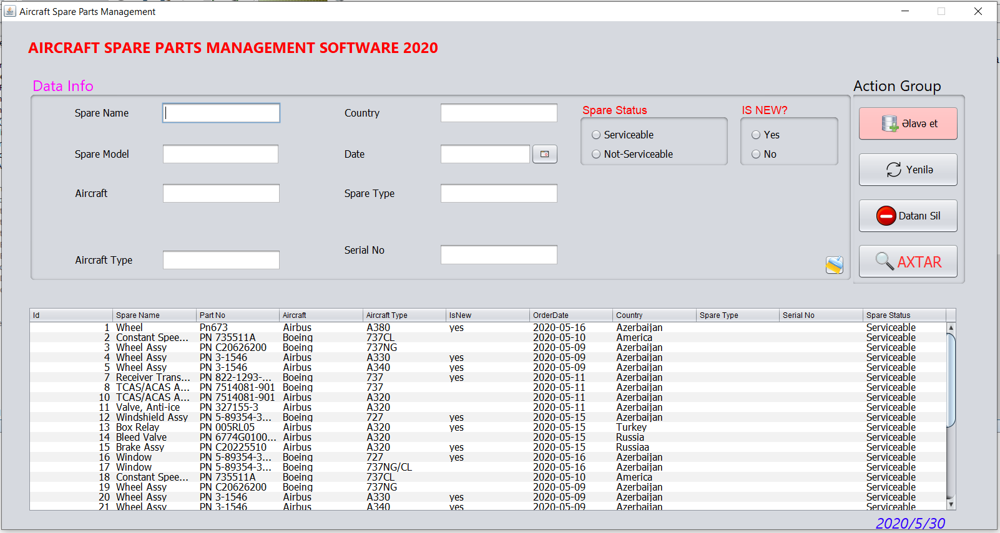
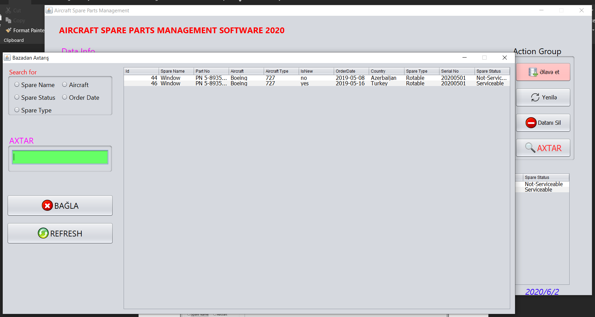

# BURAXILIŞ İŞİ
---

## Proqramlaşdırma dili
Buraxılış işimi **Java** proqramlaşdırma dilindən istifadə edərək **NetBeans IDE 8.2**'də yazmışam. Buraxılış işimin mövzusu `Aviamüəssisədə təyyarələrin ehtiyat hissələrinin istifadəsinin idarə olunması üçün proqram təminatının işlənilməsi`nə həsr edilmişdir.
## Proqramın interfeysi


**Şəkil 1** - Proqramın əsas interfeysi


**Şəkil 2** - Axtarış pəncərəsi
## Verilənlər Bazası
Bazanı **SQL**'də qurmuşam, **MySQL Workbench** proqramından istifadə edərək. Eyni zamanda **phpMyAdmin** də istifadə etmişəm.<br>
<span style = "color: red"> Bazanın SQL əmrləri vasitəsilə yaradılması: </span>
```
CREATE DATABASE spareparts;
```
<span style = "color: red"> Table'nin yaradılması: </span>
```
CREATE TABLE IF NOT EXISTS parts (
    part_id INT AUTO_INCREMENT PRIMARY KEY,
    SpareName VARCHAR(255) NOT NULL,
    PartNo VARCHAR(255) NOT NULL,
    Aircraft VARCHAR(255) NOT NULL,
    AircraftType VARCHAR(255) NOT NULL,
    IsNew ENUM('yes','no') NOT NULL,
    OrderDate Date,
    Country VARCHAR(255) NOT NULL, 
    SpareType VARCHAR(255) NOT NULL,
    SerialNo VARCHAR(255) NOT NULL,
    SpareStatus ENUM('Serviceable', 'Not-Serviceable') NOT NULL
)  ENGINE=INNODB;
```
